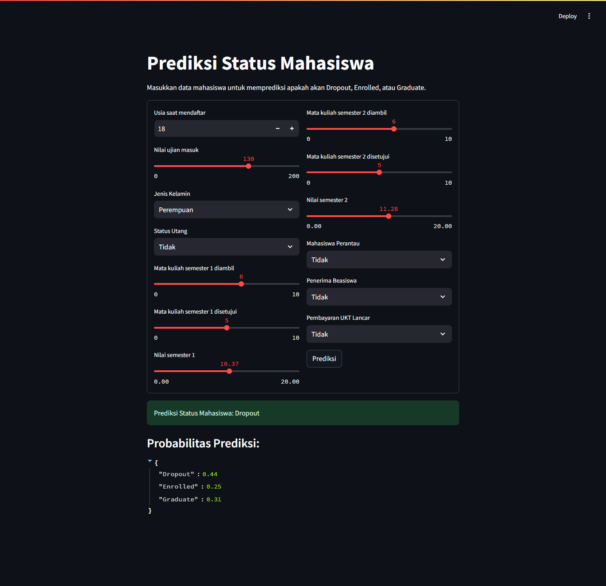
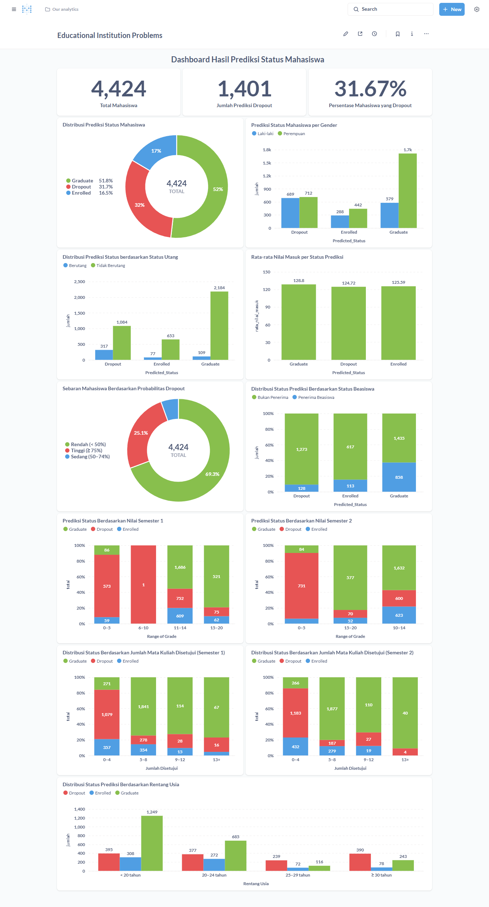

# Submission Akhir: Menyelesaikan Permasalahan Institusi Pendidikan
- **Nama:** Muhammad Dila
- **Email:** muhammaddila.all@gmail.com
- **ID Dicoding:** muhdila

---

# Business Understanding

## Latar Belakang Bisnis

Tingginya angka mahasiswa yang mengalami dropout (DO) menjadi salah satu tantangan utama bagi institusi pendidikan tinggi. Dropout tidak hanya berdampak pada mahasiswa secara pribadi, tetapi juga memengaruhi reputasi institusi dan efektivitas alokasi sumber daya.

Pihak kampus membutuhkan dukungan berbasis data untuk mengidentifikasi pola dan faktor yang menyebabkan mahasiswa berhenti kuliah, serta sistem prediktif yang dapat membantu mendeteksi mahasiswa berisiko dropout sejak dini.

---

## Permasalahan Bisnis

- Tidak tersedia sistem otomatis untuk memantau potensi dropout mahasiswa.
- Institusi kesulitan menganalisis ribuan data akademik dan sosial secara manual.
- Belum ada pemetaan visualisasi yang memberikan insight terkait faktor utama penyebab dropout.
- Dibutuhkan model prediktif yang dapat memberikan estimasi status akhir mahasiswa berdasarkan data semester awal.

---

## Cakupan Proyek

Proyek ini mencakup:

- Exploratory Data Analysis (EDA) dan pembersihan data mahasiswa.
- Identifikasi fitur penting yang berkorelasi dengan status akhir mahasiswa.
- Pelatihan model klasifikasi untuk memprediksi status akhir (Dropout, Enrolled, Graduate).
- Evaluasi model menggunakan metrik akurasi, recall, dan f1-score.
- Implementasi model ke dalam aplikasi prediksi Streamlit.
- Pembuatan business dashboard di Metabase untuk visualisasi insight dan deteksi risiko.
    
---

## Persiapan

### **Sumber Data**

Dataset diambil dari [dicoding_dataset/students_performance](https://github.com/dicodingacademy/dicoding_dataset/blob/main/students_performance/data.csv) yang mencakup:

---

### **Setup Lingkungan (Environment Setup)**

Agar seluruh proses analisis, prediksi, dan visualisasi berjalan dengan lancar, berikut adalah langkah-langkah setup yang direkomendasikan:

---

#### 1. **Menjalankan `notebook.ipynb`**
- Pastikan seluruh **library dan dependensi** yang diperlukan telah terinstal (cek file `requirements.txt`).
- Notebook ini dapat dibuka di Google Colab, JupyterLab, atau IDE lokal seperti VSCode.
- Jalankan sel secara berurutan untuk melakukan data exploration, preprocessing, feature selection, modeling, dan evaluasi.

---

#### 2. **Menjalankan `app.py` (Streamlit App)**
- Script ini berfungsi sebagai **interface interaktif** untuk memprediksi status mahasiswa berdasarkan input fitur akademik dan sosial.
- Jalankan dari terminal dengan perintah berikut:
  ```bash
  streamlit run app.py
  ```
- Aplikasi akan menampilkan form input, melakukan prediksi, dan menampilkan hasil prediksi serta probabilitasnya berdasarkan model Random Forest dan scaler yang telah dilatih dan disimpan.

---

#### **3. Menjalankan Dashboard**
Untuk melihat **dashboard** secara langsung, Anda dapat menggunakan **Metabase** dengan bantuan **Docker**. Pastikan **Docker** telah terpasang di sistem Anda.

**Langkah-langkah untuk menjalankan Metabase menggunakan Docker**:
1. **Tarik (pull) image Metabase dari Docker Hub** dengan perintah:
   ```bash
   docker pull metabase/metabase:latest
   ```

2. **Jalankan container Metabase** dengan perintah:
   ```bash
   docker run -p 3000:3000 --name metabase metabase/metabase
   ```

3. **Login ke Metabase** menggunakan kredensial berikut:
   - **email**: `root@mail.com`
   - **Password**: `root123`
   - atau
   - **Username**: `muhammaddila.all@gmail.com`
   - **email**: `313200863MuhDila`

Dengan mengikuti langkah-langkah ini, Anda dapat memulai **analisis data** dan **dashboard**, serta melihat hasil visualisasi langsung di **Metabase**.

---

# Aplikasi Prediksi (Streamlit)

Sebagai bagian dari implementasi model prediksi, aplikasi berbasis **Streamlit** telah dibuat untuk mempermudah stakeholder atau pihak akademik melakukan prediksi status mahasiswa secara interaktif.

### Fitur Utama:
- Input manual berupa **usia**, **nilai ujian masuk**, **jumlah mata kuliah**, **status keuangan**, dan lainnya.
- Model melakukan prediksi terhadap tiga kemungkinan status akhir:
  - **Dropout**
  - **Enrolled**
  - **Graduate**
- Terdapat **probabilitas prediksi** untuk setiap kelas, ditampilkan dalam format JSON agar mudah dibaca dan diolah lebih lanjut.

### Tampilan Aplikasi



Aplikasi ini dapat dijalankan secara lokal dengan perintah:

```bash
  streamlit run app.py
```


### Akses Aplikasi Online

Aplikasi ini juga dapat diakses secara online melalui Streamlit Community Cloud:

🔗 [Link Streamlit Community Cloud](https://muhdila-submission-akhir-menyelesaikan-permasalahan--app-6fgsnf.streamlit.app/)


---

# Business Dashboard

Business dashboard ini dibuat menggunakan **Metabase** untuk memberikan visualisasi interaktif yang membantu departemen HR dalam memahami pola dan faktor yang mempengaruhi tingginya tingkat keluar karyawan (attrition) di perusahaan **Jaya Jaya Maju**.

## Tujuan Dashboard
Dashboard ini berfungsi untuk:
- Menampilkan ringkasan total mahasiswa, jumlah prediksi dropout, dan persentase dropout.
- Memvisualisasikan faktor-faktor akademik dan sosial yang berkorelasi dengan status akhir mahasiswa.
- Menyajikan distribusi status prediksi mahasiswa berdasarkan gender, status utang, beasiswa, nilai, dan usia.
- Memberikan informasi sebaran probabilitas risiko dropout berdasarkan hasil model.

## Tampilan Dashboard



## Fitur-Fitur Dashboard:
- **Pie Chart Status Mahasiswa**: Menampilkan distribusi Graduate (51.8%), Dropout (31.7%), dan Enrolled (16.5%).
- **Jumlah & Persentase Dropout**: Total 1.401 mahasiswa diprediksi dropout dari 4.424 (31.67%).
- **Distribusi Berdasarkan Fitur Sosial**:
  - **Gender**: Perempuan dan laki-laki memiliki sebaran dropout yang seimbang.
  - **Status Utang**: Mahasiswa yang memiliki utang cenderung lebih banyak dropout.
  - **Penerima Beasiswa**: Proporsi dropout lebih tinggi pada mahasiswa non-penerima beasiswa.
  - **Usia**: Mahasiswa <20 tahun dan 20–24 tahun mendominasi dropout.
- **Distribusi Berdasarkan Fitur Akademik**:
  - **Nilai Ujian Masuk**: Mahasiswa dengan nilai masuk rendah memiliki dropout lebih tinggi.
  - **Nilai Semester 1 & 2**: Dropout didominasi oleh mahasiswa dengan nilai rendah.
  - **Jumlah Mata Kuliah Disetujui**: Mahasiswa yang menyetujui sedikit mata kuliah lebih berisiko dropout.
- **Probabilitas Dropout**: Visualisasi pie chart tingkat risiko dropout (rendah, sedang, tinggi) berdasarkan prediksi model.

## Akses Dashboard
Dashboard ini dapat diakses melalui Metabase secara lokal:

- **Email**: `muhammaddila.all@gmail.com`
- **Password**: `313200863MuhDila!`
- **URL lokal**: [http://localhost:3000](http://localhost:3000)

Dashboard ini juga telah diekspor dalam bentuk file database `.mv.db` dan disertakan dalam submission.

# Conclusion

Proyek ini berhasil menyelesaikan tantangan dalam memahami dan memprediksi **status akhir mahasiswa** berdasarkan data sosial dan akademik dari institusi pendidikan. 

Melalui proses EDA, feature engineering, modeling, dan visualisasi dashboard, ditemukan bahwa fitur-fitur seperti **status utang**, **jumlah mata kuliah disetujui**, **nilai semester**, dan **usia saat mendaftar** memiliki kontribusi signifikan terhadap prediksi dropout.

Model terbaik yang digunakan untuk prediksi adalah **Random Forest**, dengan performa sebagai berikut:
- **Akurasi**: 78%
- **Recall kelas Dropout**: 76%
- **F1-score Weighted**: 0.78

Dashboard interaktif telah dibangun menggunakan **Metabase**, yang membantu menampilkan insight visual dari distribusi status mahasiswa, termasuk gender, status keuangan, dan kinerja akademik.

Dengan hasil ini, institusi pendidikan memiliki dasar kuat untuk:
- Mengidentifikasi mahasiswa berisiko dropout.
- Merancang program intervensi berbasis data.
- Meningkatkan layanan bimbingan akademik dan sosial.

---

# Rekomendasi Action Items

Berikut adalah beberapa langkah strategis berdasarkan hasil analisis:

- **Monitoring Mahasiswa Risiko Tinggi:**  
  Fokus pada mahasiswa dengan probabilitas dropout > 0.75 dan tindak lanjuti dengan pendekatan personal atau konseling.

- **Pendekatan Proaktif terhadap Mahasiswa dengan Utang:**  
  Karena status utang berasosiasi dengan dropout, perlu ada kebijakan dukungan finansial atau fleksibilitas pembayaran.

- **Optimalisasi Dukungan Akademik:**  
  Berikan bimbingan tambahan kepada mahasiswa dengan nilai semester rendah dan jumlah mata kuliah disetujui sedikit.

- **Perhatian Khusus terhadap Mahasiswa Muda:**  
  Mahasiswa < 20 tahun atau 20–24 tahun mendominasi populasi dropout, sehingga butuh pendampingan awal yang lebih intensif.

- **Integrasi Model Prediktif ke Sistem Akademik:**  
  Gunakan model machine learning dalam sistem informasi kampus untuk memantau risiko dropout secara rutin.

---

Dengan penerapan rekomendasi ini, institusi pendidikan dapat menurunkan tingkat dropout, meningkatkan retensi, serta membantu mahasiswa menyelesaikan studi tepat waktu.
